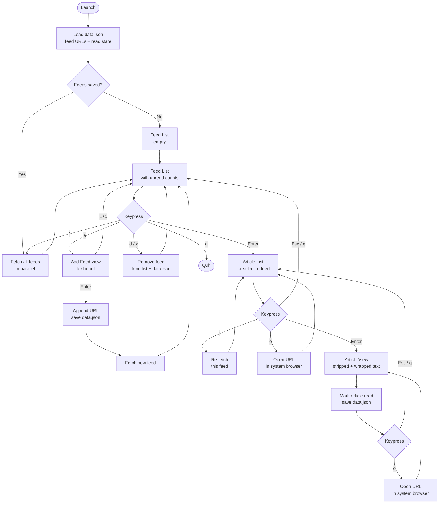

# goread

A lightweight, keyboard-driven RSS/Atom newsreader for the terminal, built with Go and [Bubble Tea](https://github.com/charmbracelet/bubbletea).

Feeds are fetched in parallel on startup. Read state and your feed list persist between sessions.

---

## Installation

```bash
git clone <your-repo>
cd goread
go build ./...
```

Requires Go 1.21 or later.

---

## Usage

```bash
./goread          # data stored in your user config directory
./goread -local   # data stored in ./data.json (commit-friendly)
```

On first launch the feed list will be empty. Press `a` to add your first RSS or Atom feed URL.

---

## Keyboard Controls

### Feed List

| Key | Action |
|-----|--------|
| `↑` / `↓` | Navigate feeds |
| `Enter` | Open feed and view its articles |
| `a` | Add a new feed (enter URL, then `Enter`) |
| `d` / `x` | Delete the selected feed |
| `r` | Refresh all feeds |
| `q` | Quit |

### Article List

| Key | Action |
|-----|--------|
| `↑` / `↓` | Navigate articles |
| `Enter` | Read the selected article |
| `o` | Open article in the system browser |
| `r` | Refresh this feed |
| `Esc` / `q` | Back to feed list |

### Article View

| Key | Action |
|-----|--------|
| `↑` / `↓` | Scroll line by line |
| `PgUp` / `PgDn` | Scroll page by page |
| `o` | Open article in the system browser |
| `Esc` / `q` | Back to article list |

### Add Feed

| Key | Action |
|-----|--------|
| `Enter` | Confirm and fetch the feed |
| `Esc` | Cancel |

---

## How Non-Text Content Is Handled

RSS and Atom feeds are XML documents but often contain non-text elements:

| Content Type | How goread handles it |
|---|---|
| **HTML markup** | Stripped to plain text; block tags (`<p>`, `<br>`, `<div>`, etc.) become newlines |
| **HTML entities** | Unescaped (`&amp;` → `&`, `&nbsp;` → space, etc.) |
| **Images** | Silently skipped; press `o` to open the full article in your browser |
| **Audio / Video** | Enclosures are ignored; open in browser to access media |
| **Atom feeds** | Parsed identically to RSS via [gofeed](https://github.com/mmcdole/gofeed) |

---

## Data Storage

Feed URLs, cached titles, and per-article read state are stored as JSON at:

| OS | Path |
|---|---|
| Windows | `%APPDATA%\goread\data.json` |
| macOS | `~/Library/Application Support/goread/data.json` |
| Linux | `~/.config/goread/data.json` |

Run with `-local` to use `./data.json` in the current directory instead, so your feed list and read state can be committed to a repository.

---

## Program Logic



---

## Dependencies

| Package | Purpose |
|---|---|
| [charmbracelet/bubbletea](https://github.com/charmbracelet/bubbletea) | TUI framework (Elm-architecture event loop) |
| [charmbracelet/bubbles](https://github.com/charmbracelet/bubbles) | List, viewport, and text input components |
| [charmbracelet/lipgloss](https://github.com/charmbracelet/lipgloss) | Terminal styling and colors |
| [mmcdole/gofeed](https://github.com/mmcdole/gofeed) | RSS and Atom feed parsing |

---

## Architecture

### Project Layout

```
goread/
├── main.go        Entry point
├── model.go       TUI — all views, state machine, input handling, rendering
├── feed.go        Data types, feed fetching, HTML cleaning
├── storage.go     Persistence — load/save data.json
├── go.mod         Module definition and dependency versions
└── go.sum         Dependency checksums
```

---

### `main.go`

The entry point. It calls `newModel()` to build the initial application state, then hands it to Bubble Tea's `NewProgram` and starts the event loop with `p.Run()`. The `tea.WithAltScreen()` option switches the terminal into full-screen mode for the duration of the app.

---

### `feed.go`

Defines the core data types and handles all network I/O.

**Types:**

| Type | Fields | Purpose |
|---|---|---|
| `Feed` | `URL`, `Title`, `Articles []Article` | Represents one subscribed feed held in memory |
| `Article` | `Title`, `Link`, `Content`, `Published`, `GUID`, `Read` | Represents one item from a feed |

**Functions:**

| Function | Purpose |
|---|---|
| `fetchFeed(url)` | Downloads and parses a feed URL using `gofeed`. Handles both RSS and Atom. Returns a `*Feed` with all articles populated. |
| `cleanHTML(s)` | Strips HTML from article content so it is readable in a plain-text terminal. Block-level tags (`<p>`, `<br>`, `<div>`, `<h1>`–`<h6>`, `<li>`, `<tr>`, `<blockquote>`) are converted to newlines; all remaining tags are removed; HTML entities are unescaped. |

**Content preference:** `fetchFeed` prefers `item.Content` (full article body) over `item.Description` (excerpt), falling back to the description when content is absent.

**GUID fallback:** If an item has no GUID, the article link is used instead. GUIDs are the keys for read-state tracking in storage.

---

### `storage.go`

Handles all persistence. The app's state is stored as a single JSON file.

**Type:**

```go
type storedData struct {
    FeedURLs []string          // Ordered list of subscribed feed URLs
    Titles   map[string]string // URL → cached feed title
    Read     map[string]bool   // Article GUID → read flag
}
```

**Functions:**

| Function | Purpose |
|---|---|
| `dataPath()` | Returns the platform-appropriate path for `data.json` |
| `loadData()` | Reads and unmarshals `data.json`. Returns an empty struct (not an error) if the file does not exist yet. |
| `saveData(d)` | Marshals `storedData` to indented JSON and writes it, creating the directory if needed. Called after every mutation: adding/removing a feed, marking an article read, caching a feed title. |

---

### `model.go`

The largest file. Contains everything related to the TUI: state machine, event handling, rendering, and layout helpers. Follows the [Elm architecture](https://guide.elm-lang.org/architecture/) enforced by Bubble Tea — every interaction flows through `Update`, and `View` is a pure render of the current state.

**App states:**

```
stateFeedList     — list of all subscribed feeds
stateArticleList  — list of articles for the selected feed
stateArticleView  — scrollable plain-text view of one article
stateAddFeed      — text input prompt for a new feed URL
```

**Model fields:**

| Field | Type | Purpose |
|---|---|---|
| `state` | `appState` | Which view is currently active |
| `feeds` | `[]*Feed` | In-memory feed data (URL, title, articles) |
| `data` | `*storedData` | Live reference to the persisted data struct |
| `feedList` | `list.Model` | Bubble Tea list component for the feed view |
| `articleList` | `list.Model` | Bubble Tea list component for the article view |
| `viewport` | `viewport.Model` | Scrollable content area for article reading |
| `input` | `textinput.Model` | Text input for the add-feed prompt |
| `currentFeedIdx` | `int` | Index into `feeds` for the open feed |
| `pendingFetches` | `int` | Counter of in-flight fetch goroutines |
| `width`, `height` | `int` | Current terminal dimensions |
| `statusMsg` | `string` | Informational status shown in the title bar |
| `errMsg` | `string` | Error message shown in the title bar (takes priority over status) |

**Custom message type:**

```go
type feedFetchedMsg struct {
    url  string
    feed *Feed
    err  error
}
```

Returned by fetch goroutines when a feed download completes. `pendingFetches` is decremented on each receipt; when it reaches zero the status bar is updated with the last-refresh time.

**List delegates:**

Bubble Tea's `list.Model` delegates item rendering to a `list.ItemDelegate`. Two are defined:

| Delegate | Used by | Renders |
|---|---|---|
| `feedDelegate` | `feedList` | Feed title (bold+purple if selected) and unread/total count below |
| `articleDelegate` | `articleList` | Article title with a `●` dot for unread items, and the publish date below |

Each delegate renders 2 lines per item.

**Key functions:**

| Function | Purpose |
|---|---|
| `newModel()` | Constructs the initial model: loads storage, initialises all Bubble Tea components, reconstructs `feeds` from stored URLs with cached titles |
| `Init()` | Kicks off parallel fetches for all stored feeds at startup |
| `Update(msg)` | Top-level message handler: routes `WindowSizeMsg` and `feedFetchedMsg` globally, then delegates key events to the active state's handler |
| `updateFeedList` | Handles keys in the feed list: `enter` → article list, `a` → add feed, `d`/`x` → delete, `r` → refresh all |
| `updateArticleList` | Handles keys in the article list: `enter` → article view (marks read), `o` → open browser, `r` → refresh this feed |
| `updateArticleView` | Handles keys in article view: scrolling delegated to viewport, `o` → open browser |
| `updateAddFeed` | Handles the URL input: `enter` → saves URL, triggers fetch; `esc` → cancel |
| `View()` | Dispatches to one of four view functions based on current state |
| `resize()` | Called on every `WindowSizeMsg`; updates sizes of list, viewport, and input to fit the terminal |
| `syncFeedList()` | Rebuilds `feedList`'s item slice from `feeds` |
| `syncArticleList()` | Rebuilds `articleList`'s item slice from the current feed's articles |
| `fetchAll()` | Fans out one `tea.Cmd` per feed using `tea.Batch`, so all feeds are fetched concurrently |
| `renderArticle(a)` | Formats an article for the viewport: title, separator, date, then word-wrapped body |
| `wordWrap(text, width)` | Wraps text to a given column width, preserving paragraph breaks |
| `openURL(url)` | Opens a URL in the system default browser using `start` (Windows), `open` (macOS), or `xdg-open` (Linux) |

---

### Data Flow

```
startup
  └─ loadData()              reads data.json → storedData
  └─ newModel()              builds Feed stubs from stored URLs + titles
  └─ Init()                  fires fetchAll() → N concurrent tea.Cmds

each feedFetchedMsg
  └─ merge read state        marks articles read if GUID in storedData.Read
  └─ update feeds[i]         replaces stub with full Feed
  └─ saveData()              persists updated title cache
  └─ syncFeedList()          pushes new items into list component

user adds a feed
  └─ addFeed(url)            appends to feeds + storedData.FeedURLs, saves
  └─ fetchFeed(url) cmd      single concurrent fetch → feedFetchedMsg

user opens an article
  └─ a.Read = true           marks in-memory
  └─ storedData.Read[guid]   persists immediately via saveData()
  └─ renderArticle()         formats content for viewport
```
